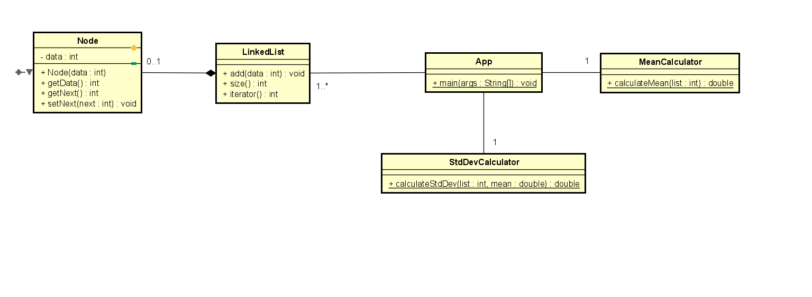
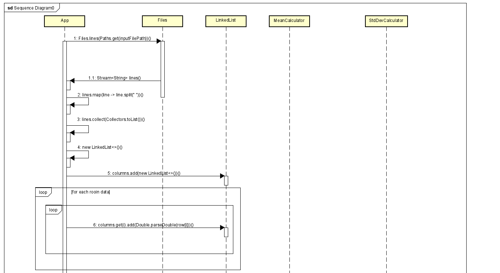
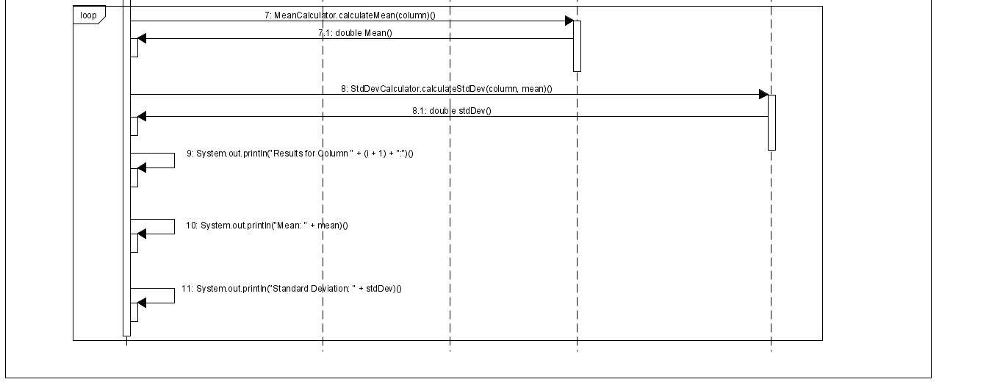
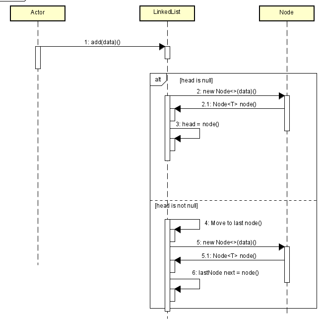
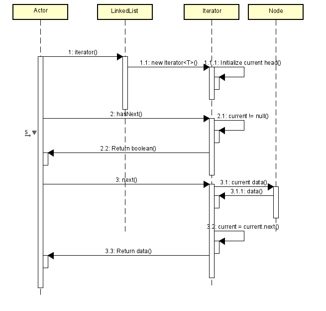
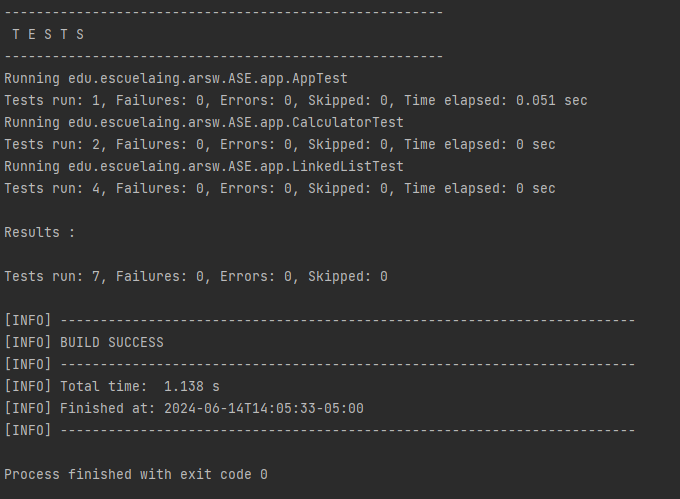

https://github.com/juaneortiz1/MeanStdDevCalculator.git

# MeanStdDevCalculator

This Java application calculates the mean and standard deviation of columns from numerical data stored in a text file. It utilizes a custom LinkedList implementation to organize and process the data, demonstrating fundamental data structure operations and statistical calculations.


### Input File Format

The input file should be a text file where each line contains numerical values separated by spaces. Each value in the line represents an element in a column.

Example:
```
1.0 2.0 3.0
4.0 5.0 6.0
7.0 8.0 9.0
```

## Project Structure
The project consists of the following main classes:

- **App**: Reads input from a file, processes data, and calculates statistics.
- **LinkedList**: Custom linked list used to store data columns.
- **MeanCalculator**: Calculates the mean of numbers stored in a linked list.
- **StdDevCalculator**: Calculates the standard deviation of numbers stored in a linked list.
- **Node**: Class used in LinkedList that represents a node holding data.

The project directory structure:

## Diagram Class



## Important Sequence Diagram
**App**
main method



**Linked List**

add method

interator methods overrided

```
mean-std-dev-calculator/
├── src/
│   ├── main/
│   │   └── java/
│   │       └── edu/
│   │           └── escuelaing/
│   │               └── arsw/
│   │                   └── ASE/
│   │                       └── app/
│   │                           ├── App.java
│   │                           ├── LinkedList.java
│   │                           ├── MeanCalculator.java
│   │                           └── StdDevCalculator.java
│   └── test/
│       └── java/
│           └── edu/
│               └── escuelaing/
│                   └── arsw/
│                       └── ASE/
│                           └── app/
│                               ├── LinkedListTest.java
│                               └── MeanStdDevCalculatorTest.java
├── pom.xml
└── src/
    └── test/
        └── resources/
            └── columnNumbers.txt
```

## Usage

1. **Input File**: Place your input file (e.g., `columnNumbers.txt`) containing columns of numbers in the `src/test/resources/` directory or place the path where is located your text file.
2. **Run the Application**:
   - Compile the project: `mvn compile`
   - Run the application with your input file: `java -jar target/MeanStdDevCalculator-1.0-SNAPSHOT.jar src/test/resources/columnNumbers.txt` or wherever is located .Jar file is located.

```bash
java -jar MeanStdDevCalculator.jar <input-file>
```

Replace `<input-file>` with the path to your file containing the numbers.

## Testing

This project includes unit tests for the `LinkedList` class, mean calculation (`MeanCalculator`), and standard deviation calculation (`StdDevCalculator`). Test files are located in the `src/test/java/` directory.

To run the tests:

```bash
mvn test
```

## Built With

- [Java](https://www.oracle.com/java/technologies/)
- [Maven](https://maven.apache.org/)

## Author

- Juan Esteban Ortiz


